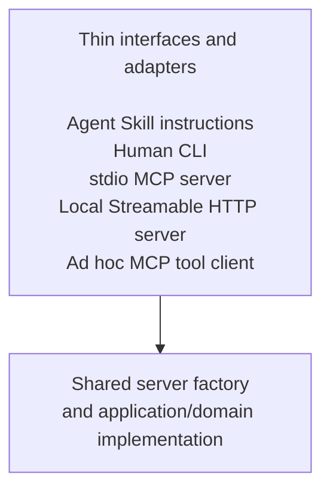

# Language-neutral Agent Skill Template

This repository is a template for developing a portable Agent Skill whose repository root is intended to become the skill directory itself.

Typical installation target:

```text
<project>/.agents/skills/<skill-name>/
```

The template deliberately does **not** select Python, Node.js, uv, pip, npm, pnpm, yarn, bun, or any other implementation runtime. A concrete skill selects exactly the runtime and packaging conventions it needs.

## What this template defines

The template defines stable responsibilities rather than language-specific boilerplate:

- `SKILL.md`: runtime instructions presented to an agent;
- `AGENTS.md`: development rules for agents modifying the skill;
- `RUNTIME.md`: the selected runtime, package manager, commands, lockfile policy, and MCP transport decisions;
- `INTERFACES.md`: the public CLI and MCP contracts;
- `references/`: documents read while the skill is being used;
- `scripts/`: stable in-place launchers or helper commands, when needed;
- `mcp/`: optional stdio and local Streamable HTTP MCP adapters plus bounded ad hoc MCP tool clients;
- `src/`: implementation selected by the concrete skill;
- `tests/`: language-appropriate tests;
- `docs/`: maintainer documentation not normally loaded during skill execution.

## Creating a concrete skill

1. Create a repository from this template.
2. Choose the final skill name using lowercase letters, digits, and hyphens.
3. Update the `name` and `description` fields in `SKILL.md`.
4. Complete `RUNTIME.md` before adding implementation code.
5. Complete the execution-policy section of `INTERFACES.md`.
6. Select one primary implementation runtime.
7. Add only the manifests and lockfiles required by that runtime.
8. Implement a human-usable CLI and, when justified, MCP adapters over the same application logic.
9. Decide independently whether the skill supports ad hoc stdio MCP, a standalone local Streamable HTTP MCP server, or both.
10. Replace `LICENSE.template` with the selected license.
11. Remove template guidance that no longer applies.

## Installation modes

Clone as a user-level skill:

```sh
git clone <repository-url> ~/.agents/skills/<skill-name>
```

Track as a project-level submodule:

```sh
git submodule add <repository-url> .agents/skills/<skill-name>
```

Vendoring a release archive into `.agents/skills/<skill-name>/` is also valid when the parent repository should own the files directly.

## Runtime neutrality

Runtime neutrality does not mean implementing every runtime. It means delaying the choice until the concrete skill has enough information to make one defensible choice.

Do not add all of the following merely as alternatives:

```text
pyproject.toml
requirements.txt
package.json
uv.lock
package-lock.json
pnpm-lock.yaml
yarn.lock
bun.lock
```

Add only the files for the selected implementation and distribution model. Guidance for making that selection is in `docs/runtime-selection.md`.

## CLI and MCP

A concrete skill should normally have one reusable application layer with thin interfaces and adapters:



The stdio variant is normally launched on demand by an MCP host or by the skill's bundled ad hoc MCP tool client. It uses no listening socket and exits with the client connection or invocation.

The standalone local variant should use the standard Streamable HTTP transport over a loopback TCP socket, normally at an endpoint such as `http://127.0.0.1:<port>/mcp`. “Raw TCP MCP” is not the standard interoperable network transport.

A bundled command that only discovers and invokes tools should be described as an **ad hoc MCP tool client**, not as a complete MCP host. Its command-line syntax is local to the skill; MCP standardizes protocol methods, messages, capabilities, lifecycle, and transports rather than CLI option names. `INTERFACES.md` must map each client command to the MCP methods it uses and declare supported protocol revisions and optional features.

Both MCP variants must reuse the same tool definitions and application logic. The exact commands, endpoint, lifecycle, security policy, protocol support, and preferred agent execution route are declared in `RUNTIME.md` and `INTERFACES.md`. The agent should not have to guess between equivalent entry points.

See `docs/mcp-transports.md` for the transport, protocol-client, and security decision model.
