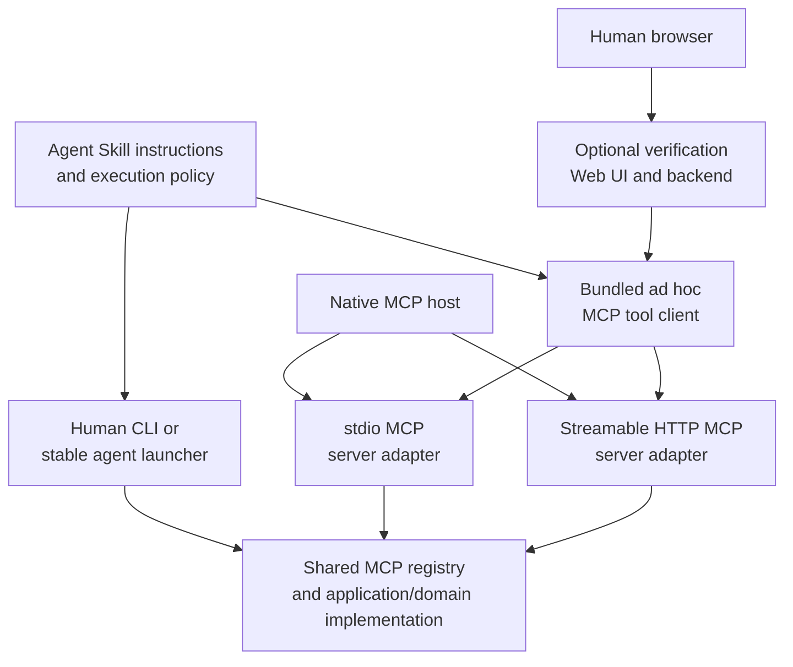

# Language-neutral Agent Skill Template

This repository is a template for developing a portable Agent Skill whose repository root is intended to become the skill directory itself.

Typical installation target:

```text
<project>/.agents/skills/<skill-name>/
```

The template deliberately does **not** select Python, Node.js, uv, pip, npm, pnpm, yarn, bun, or any other implementation runtime. A concrete skill selects exactly the runtime and packaging conventions it needs.

## What this template defines

The template defines stable responsibilities rather than language-specific boilerplate:

- `SKILL.md`: runtime instructions presented to an agent;
- `AGENTS.md`: development rules for agents modifying the skill;
- `RUNTIME.md`: the authoritative runtime, package-manager, command, MCP revision, SDK, transport, and deployment-capability decisions;
- `INTERFACES.md`: the public CLI and MCP behavior contracts;
- `WEB_INTERFACE.md`: the optional human-facing verification, debugging, or limited-operations web contract;
- `references/`: documents read while the skill is being used;
- `scripts/`: stable in-place launchers or helper commands, when needed;
- `mcp/`: optional stdio and local Streamable HTTP MCP adapters plus bounded ad hoc MCP tool clients;
- `src/`: implementation selected by the concrete skill;
- `tests/`: language-appropriate tests;
- `docs/`: maintainer documentation not normally loaded during skill execution.

## Creating a concrete skill

1. Create a repository from this template.
2. Choose the final skill name using lowercase letters, digits, and hyphens.
3. Update the `name` and `description` fields in `SKILL.md`.
4. Complete `RUNTIME.md` before adding implementation code.
5. Complete the execution-policy section of `INTERFACES.md`.
6. Decide whether a human-facing verification web interface is supported and complete `WEB_INTERFACE.md` when it is.
7. Select one primary implementation runtime.
8. Add only the manifests and lockfiles required by that runtime.
9. Implement a human-usable CLI and, when justified, MCP adapters over the same application logic.
10. Decide independently whether the skill supports stdio MCP, a standalone Streamable HTTP MCP server, a bundled MCP tool client, a human verification web interface, or a documented combination.
11. Replace `LICENSE.template` with the selected license.
12. Remove template guidance that no longer applies.

## Installation modes

Clone as a user-level skill:

```sh
git clone <repository-url> ~/.agents/skills/<skill-name>
```

Track as a project-level submodule:

```sh
git submodule add <repository-url> .agents/skills/<skill-name>
```

Vendoring a release archive into `.agents/skills/<skill-name>/` is also valid when the parent repository should own the files directly.

## Runtime neutrality

Runtime neutrality does not mean implementing every runtime. It means delaying the choice until the concrete skill has enough information to make one defensible choice.

Do not add all of the following merely as alternatives:

```text
pyproject.toml
requirements.txt
package.json
uv.lock
package-lock.json
pnpm-lock.yaml
yarn.lock
bun.lock
```

Add only the files for the selected implementation and distribution model. Guidance for making that selection is in `docs/runtime-selection.md`.

## CLI, MCP, and optional verification Web UI

A concrete skill should normally have one application/domain implementation with thin public adapters. A bundled MCP tool client must traverse an MCP transport; it must not call the application layer directly while presenting the result as an MCP invocation.



The stdio variant is normally launched on demand by an MCP host or by the skill's bundled MCP tool client. It uses no listening socket and exits according to the selected SDK's connection and child-process lifecycle.

The standalone network variant should use the standard Streamable HTTP transport, normally at an endpoint such as `http://127.0.0.1:<port>/mcp` for local-only use. “Raw TCP MCP” is not the standard interoperable network transport.

A bundled command that only discovers and invokes tools should be described as an **ad hoc MCP tool client**, not as a complete MCP host or general-purpose MCP client. Its command-line syntax is local to the skill; MCP standardizes protocol methods, messages, capabilities, lifecycle, and transports rather than CLI option names.

A human-facing verification page is optional and is not part of MCP. It may be disabled by default and enabled only for debugging. The template does not force it into a separate process, port, container, Pod, or service. It may share a process, container, listener, or external origin with the MCP server when appropriate, provided routing, authentication, authorization, health checks, and failure behavior remain logically separate.

A page that claims to verify MCP behavior must exercise the actual MCP path. It may reuse the same MCP client library as the bundled tool client. Deployment may later choose a same-process route, a separate process in one container, a sidecar, a separate service, or a reverse proxy presenting one external origin.

At the time this template was aligned, `2026-07-28` is the current stateless, per-request modern revision, while `2025-11-25` and earlier revisions use the initialization-era protocol model. The template does not force either era. A concrete skill must verify the current specification and selected SDK, then record its supported revisions and compatibility policy in `RUNTIME.md`.

Both MCP server variants must reuse the same tool definitions and application logic. `RUNTIME.md` is the source of truth for runtime, SDK, revision, transport support, and supported deployment choices. `INTERFACES.md` defines public CLI and MCP behavior. `WEB_INTERFACE.md` defines the optional browser-facing interface without preselecting a container topology.

See `docs/mcp-transports.md` for the transport, protocol-client, compatibility, and security decision model.
