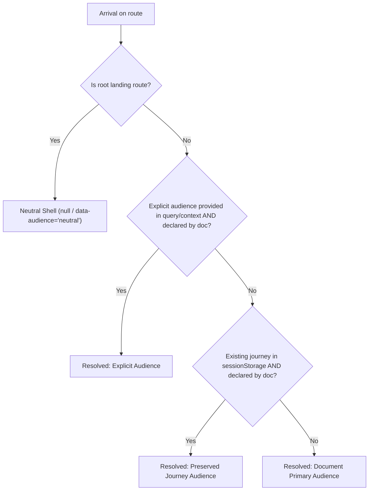

# Audience architecture reconciliation and context contract

> **Historical design record:** This pre-cutover design records the audience migration.
> The current public destination/semantic navigation authority is Integration's selected
> Publication Bundle. Site owns its audience UI and rendering. References below to
> a Site manifest or Site-owned integration describe the historical implementation.


## 1. Overview and Status

This document reconciles the audited candidate statuses from Sessions 1–3 with the production Site audience foundation established in Session 4. It defines the authoritative runtime contract for audience context resolution, journey persistence, and audience transitions.

| Component | Status | Authority | Location |
| :--- | :--- | :--- | :--- |
| **Manifest schema** | Schema Version 3 | Site | `site-manifest.json` |
| **Audience axes** | `use`, `maintain` | Site | `scripts/assemble_publications.py` |
| **Context resolver** | Production engine | Site | `scripts/audience_context.py` |
| **Client controller** | Runtime browser script | Site | `assets/javascripts/audience-context.js` |
| **Candidate inventory** | Historical audit; dispositions below | Site | `docs/architecture/audience/migration-matrix.json` |

---

## 2. Inventory and Candidate Reconciliation

### 2.1 Policy Authority Reconciliation (Session 1 & 4.1)
- **Policy maintainer material promoted to active authority**:
  - `contributing` (`policy/contributing.md`): Published under Maintain templates (`Development workflow > Policy > Contributing`).
  - `maintainer-workflow` (`policy/policy-maintainer-workflow.md`): Published under Maintain templates (`Authorities > Policy > Policy maintainer workflow`).
  - `adr-review-authority-and-github-runtime-boundary` (`policy/adr/0008-review-authority-and-github-runtime-boundary.md`): Published under Maintain templates (`Architecture decisions > Policy`).
  - `adr-review-result-representation-boundary` (`policy/adr/0009-review-result-representation-boundary.md`): Published under Maintain templates (`Architecture decisions > Policy`).
- **Policy provider catalog pin**: Locked to exact reviewed commit `6023af1b6aed4a22407d9ca43106cd66cfee9fb6` in `publication-sources.json` and `agent.json`.
- **Publication staging**: Verified zero unpromoted policy maintainer candidates; the four promoted mappings were removed from staging; unrelated staging mappings remain.

### 2.2 Composition Authority Reconciliation (Session 2 & 4.2)
- **Consumer vs maintainer boundaries preserved**:
  - Consumer guides (`consumer-guide`, `overview`, `composition-concepts`) serve the `use` journey.
  - Evaluation and maintainer materials (`evaluation-guide`, `publication-boundary`, `authority-migration`) serve the `maintain` journey.
  - Shared technical references (`composer-mvp`, `composition-model`, `catalog-architecture`, `generated-contract-manifest`, `catalog-guide`, `schema-guide`) serve both `use` and `maintain` journeys without duplicating content or search identity.

- **Composition publication revision**: `8c6c1884fa97f3ef1ec6c1aa7deba4ad38c9f4ff`.
  The historical architecture audit `0f0c4012818a3b8646ad89fbca7db22c71ad5dd8`
  is a design input, not the current publication lock. Composition's
  `provider-maintenance` and `installer-release` candidates are already published
  under their provider-owned identities.

### 2.3 Site candidate disposition

The ten Site-owned candidates in `future-candidates.json` are published as
canonical, Maintain-only Site documents: `MAINTENANCE.md`,
`docs/authority-model.md`, `PUBLISHING.md`, `PUBLICATION_STAGING.md`,
`PUBLICATION_FRESHNESS.md`, `FRESHNESS.md`, `GLOSSARY.md`, `LANGUAGE.md`, `PWA.md`,
and `docs/ci/site-performance.md`. Their stable identities, destinations, and
Maintain navigation are declared in the active Site catalog and manifest; the
source files retain Site semantic ownership and the publication rewriter preserves
their source-relative links. Japanese navigation is localized while untranslated
reader documents correctly fall back to their canonical English routes.

This completes the Site-owned candidate publication scope defined by architecture
S. It does not promote uncataloged provider material, duplicate provider semantics,
or turn Source views into reader publications. The historical matrix remains intact
as audit evidence and its candidate inventory remains a closed architectural scope.

---

## 3. Production Manifest Schema v3 Contract

In schema version 3, `site-manifest.json` enforces structural separation between canonical document definitions and reader navigation:

```json
{
  "schema_version": 3,
  "audiences": ["use", "maintain"],
  "home": {
    "publication": "site",
    "document": "portal-home"
  },
  "documents": [
    {
      "publication": "site",
      "document": "portal-home",
      "title": "Documentation portal",
      "destination": "index.md",
      "primary_audience": "use",
      "additional_audiences": ["maintain"]
    }
  ],
  "navigation": {
    "use": [...],
    "maintain": [...]
  }
}
```

### Invariants:
1. **Uniqueness**: Every document key `(publication, document)` and every `destination` path is globally unique across the entire manifest.
2. **Strict Audience Partition**: Every declared audience in `audiences` has an independent navigation tree in `navigation`.
3. **Bidirectional Exact Coverage**:
   - A document may appear in `navigation[audience]` if and only if it declares that audience (`primary_audience` or in `additional_audiences`).
   - If a document declares an audience, it MUST appear at least once in that audience's navigation tree.

---

## 4. Context Resolution Hierarchy

Audience context is semantic navigation state scoped to the reader's current journey. It is resolved deterministically according to the 4-step hierarchy:



### Resolution Rules:
1. **Root Landing Route**: Renders the neutral shell (`data-audience="neutral"`, resolved audience `null`). The landing route never silently redirects to a previously stored journey.
2. **Explicit Audience**: An explicit candidate passed via query parameter (e.g. `?audience=maintain`) or programmatic context is honored if and only if the document belongs to that audience.
3. **Preserved Journey**: The active journey context stored in `sessionStorage` (`templates-audience-context`) is preserved if the document belongs to that journey.
4. **Primary Audience Fallback**: When no context exists (e.g. direct deep link) or when the context does not match the document's memberships, the document's `primary_audience` is selected. Unsupported or invalid context candidates are ignored fail-closed.

---

## 5. Audience Switcher and Transition Invariants

The client-side controller (`assets/javascripts/audience-context.js`) governs transitions triggered by audience switchers:

| Current Document | Switch Action | Resulting Route | Resulting Audience | Invariant |
| :--- | :--- | :--- | :--- | :--- |
| **Shared Document** (declares both) | Switch `use` → `maintain` | Same document URL + fragment | `maintain` | Fragment preserved, no reload, history state updated |
| **Single-Audience Document** (`use` only) | Switch to `maintain` | `/repository-trees/` | `maintain` | Redirects to Maintain journey overview; document is never misclassified |
| **Single-Audience Document** (`maintain` only) | Switch to `use` | `/web/` | `use` | Redirects to Use journey overview; document is never misclassified |
| **Landing Page** (`index.md`) | Activate `use` or `maintain` | Target overview route | Selected audience | Sets journey context on departure from neutral shell |

---

## 6. History and Deep Linking

- **Browser Back / Forward (`popstate`)**: Restores the recorded journey context and re-evaluates the 4-step hierarchy.
- **Reload (`load`)**: Re-applies the recorded journey context from `sessionStorage` against the current route.
- **Canonical URLs**: Canonical URLs, `<link rel="canonical">`, and sitemaps remain strictly unadorned by audience query parameters or state tokens.

## 7. Runtime projection and lifecycle binding

`site-manifest.json` is the semantic input. Assembly regenerates the single
`audience-runtime.json` projection using `AudienceContextResolver`; translation
publication adds aliases only for actual published translations, pointing to the
same canonical membership records. The checked-in asset is a deterministic seed
whose parity is tested; it is replaced from the effective manifest during assembly.
The architecture migration matrix is never a runtime source. Browser code does not
infer audience from filenames or duplicate provider semantics. Overview values in
the runtime projection are public URLs.

The generated portal loads `audience-context.js` once. The controller fetches the
projection once per document lifetime, and subscribes to Zensical's `document$`
stream plus browser `popstate` and `pageshow`. It ignores obsolete asynchronous
resolutions and repeated initialization; one semantic route/state transition emits
one `templates:audience-changed` event. Both assets are in the existing static
Service Worker cache contract. A failed or invalid map leaves a neutral shell;
it does not fabricate Use membership. A fresh page lifetime retries the map.

Browser history stores `{path, audience}` under `templatesAudienceContext`,
preserving other history fields during audience operations. Zensical replaces
history state with scroll offsets on scroll and before navigation, while Site
viewers create fragment entries with `pushState`. A narrow history adapter
preserves only the audience namespace for same-document `replaceState` and
`pushState` operations. New-document entries from either method resolve
independently. A record is used only for its recorded path;
a valid query parameter still takes precedence. History is consulted before the
session's last journey, restoring shared pages correctly on back/forward. Shared
services preserve journey context, while the root remains neutral and retains
the stored journey for subsequent navigation. Switching shared documents preserves
fragments and other history fields; switching a single-audience document uses the
other journey's overview from the projection. These are semantic hooks only;
Session 5 presentation has not started.
