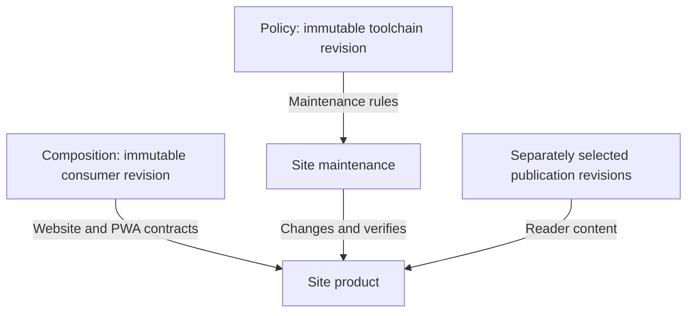

# Policy–Composition coexistence contract

## Purpose

`policy` and `composition` are independent canonical authorities that may be used separately or together in the same consumer repository. This contract defines the minimum cross-authority boundaries required for safe coexistence without introducing a direct runtime dependency, a shared consumer lock, or a third consumer-management tool.

The contract is an integration boundary. It does not transfer Policy semantics to Composition or Composition semantics to Policy.

Repository-wide authority ownership, semantic-role definitions, the Site ownership test, and the distinction between normative requirements and guidance are defined in `docs/authority-model.md`. This coexistence contract applies that model to the Policy–Composition boundary; it does not redefine the repository-wide model here.

## Authority matrix

| Authority | Owns | Does not own |
| --- | --- | --- |
| `policy` | application-type-independent coding-agent operating semantics; the `agent-policy` toolchain; Policy adoption, render, validate, and check behavior; Policy configuration, lock, runtime selection, cache, and release identity | artifact semantics; Composition component selection; Composition material ownership; Composer update/upgrade/recovery |
| `composition` | `artifact.*`, `capability.*`, and `lifecycle.*` semantics; recipes and schemas; deterministic resolution/materialization; Composition lock, ownership, update/upgrade, and recovery | coding-agent operating policy; Policy profiles; Policy runtime/release; interpretation of Policy configuration or lock state |
| `site` | repository integration and publication semantics at this boundary; reviewed provider revision selection; reader-facing information architecture; cross-provider integration validation; Pages/PWA publication | Policy semantics; Composition semantics; mutation of consumer repository state; provider-specific consumer management |

## Independent adoption states

A consumer repository may validly use:

1. neither authority;
2. Policy only;
3. Composition only; or
4. both Policy and Composition.

Neither provider may make the other a prerequisite merely because both are maintained in `TakashiSasaki/templates`.

## Exclusive namespaces

The following Policy metadata is Policy-owned and must not be claimed or mutated by Composition:

```text
.agent-policy.yml
.agent-policy.lock
.agent-policy/**
```

The following Composition metadata is Composition-owned and must not be claimed or mutated by Policy:

```text
.template-composition/lock.json
.template-composition/transaction.json
.template-composition/staging/**
```

Future provider-private metadata must remain within a clearly owned namespace or be added to this contract before another provider can claim the same path.

## Prohibited dependencies

The authority split is preserved by the following negative contract:

- Composition components, recipes, schemas, and Composer operations must not require Policy adoption.
- Policy profiles, compiler/runtime behavior, and Policy adoption/managed operations must not require Composition adoption.
- Composer must not invoke the `agent-policy` CLI or interpret `.agent-policy.yml` / `.agent-policy.lock` as Composition state.
- `agent-policy` must not invoke Composer or interpret `.template-composition/**` as Policy state.
- Policy must not be represented as a `capability.agent-policy` or equivalent Composition component unless a future architecture decision explicitly replaces this contract.
- Policy and Composition locks must not be merged into one shared lock.
- Policy and Composition transaction/recovery state must not be merged into one shared transaction manager.
- Site must not introduce an umbrella consumer-mutating CLI that becomes a third management plane above Policy and Composition.

Shared publication infrastructure and integration tests do not violate these restrictions because they operate on provider publication/input contracts rather than consumer management state.

## Ownership handoffs

Some ordinary repository paths may legitimately participate in more than one lifecycle over time. Such paths require an explicit ownership handoff; coexistence must not rely on implicit overwrite precedence.

`AGENTS.md` is the current primary example for the Skill artifact. Composition materializes the Skill artifact's `AGENTS.md` as `seed`: after initial materialization, its contents are consumer-owned rather than Composition-managed. A later explicit Policy adoption may inspect and migrate those existing instructions according to the Policy adoption contract and may eventually generate the repository's normal Policy-managed instruction projection.

The intended sequence is therefore:

```text
Composition initial
  -> seed materialization
  -> consumer ownership
  -> optional explicit Policy adoption
  -> Policy-generated steady-state instructions
```

Composition update/upgrade must preserve an already materialized active seed according to Composition's seed contract. Policy adoption must not treat the existence of a Composition lock as permission to modify Composition-exclusive metadata.

No general rule is defined for the reverse transition from a Policy-generated path to a newly selected Composition material at the same destination. Until an explicit migration contract exists for such a case, the operation must fail closed on the destination conflict rather than infer ownership transfer.

A future change that turns a known handoff path from `seed` into Composition `managed` or `generated` ownership is a cross-authority compatibility change and requires review of this coexistence contract and its integration tests.

## Collision rules

Cross-authority collision handling follows these rules:

1. Provider-exclusive metadata paths are never valid material/output destinations for the other provider.
2. An ordinary repository path already controlled by another authority must not be overwritten merely because the second authority is being adopted or upgraded.
3. Ownership transfer is valid only where the current owning contract explicitly releases ownership and the receiving operation explicitly accepts/migrates the existing state.
4. Absence of a known collision is not permission to introduce a hidden dependency on the other provider's internal schema.
5. Conflict resolution belongs to the authority that is attempting the new claim; Site integration validation may detect the conflict but does not mutate the consumer to resolve it.

## Cross-authority invariants

For a repository using both authorities:

- Policy operations must leave `.template-composition/**` unchanged.
- Composition operations must leave `.agent-policy.yml`, `.agent-policy.lock`, and `.agent-policy/**` unchanged.
- Composition update/upgrade must preserve consumer-owned active seed bytes, including a Skill `AGENTS.md` that was subsequently migrated or rewritten by explicit Policy adoption.
- Policy-generated outputs must not be configured inside Composition-exclusive metadata paths.
- Composition material destinations must not claim Policy-exclusive metadata paths.
- Each provider must remain independently valid when the other provider is absent.
- A failure in one provider's managed state must not authorize the other provider to repair, rewrite, or discard that state.

These invariants are candidates for exact-revision integration tests in Site. Provider-local tests remain responsible for each provider's own semantics.

## Consumer coexistence validation checklist

After a repository has adopted both authorities, verify them independently rather than treating one successful command as proof of the other provider's state. This checklist is a consumer verification sequence; Site does not execute it on the consumer's behalf and does not introduce an umbrella management command.

1. Inspect and validate Composition using the installed Composition skill:

   ```sh
   python /path/to/agent-skills/composition/scripts/run.py \
     --repository /path/to/repository \
     inspect
   python /path/to/agent-skills/composition/scripts/run.py \
     --repository /path/to/repository \
     validate
   ```

   Expect `inspect` to report `managed-valid` before relying on the managed Composition state.

2. Validate, render, and check Policy using the separately installed `agent-policy` skill:

   ```sh
   python /path/to/agent-skills/agent-policy/scripts/run.py \
     --repository /path/to/repository \
     validate
   python /path/to/agent-skills/agent-policy/scripts/run.py \
     --repository /path/to/repository \
     render
   python /path/to/agent-skills/agent-policy/scripts/run.py \
     --repository /path/to/repository \
     check
   ```

3. After Policy render/finalization, run Composition `inspect` and `validate` again. A legitimate `AGENTS.md` handoff remains valid because Composition transferred that active seed to consumer ownership; Policy must still leave Composition-managed metadata and managed/generated material intact.

4. Review the repository diff or equivalent before/after snapshots. Policy operations must not modify `.template-composition/**`; Composition operations must not modify `.agent-policy.yml`, `.agent-policy.lock`, or `.agent-policy/**`. Ordinary consumer-owned paths such as a handed-off `AGENTS.md` must be judged by their explicit ownership contract rather than by namespace alone.

5. Treat failures independently. Diagnose a Policy failure with Policy tooling and a Composition failure with Composition tooling. Do not use one provider to repair, rewrite, delete, or regenerate the other provider's private state.

Repeat the relevant side of this checklist after a managed operation from either provider, and repeat both sides when an ownership handoff or cross-authority configuration change is involved.

## Shared mechanisms versus shared authority

Code duplication alone is not sufficient reason to couple the providers. A mechanism should be shared only when it implements one genuinely shared protocol with one semantic owner.

The repository-wide publication catalog protocol is such a candidate: Site already owns integrated publication and can own one generic catalog parser/validator used by provider documentation CI. Provider-specific publication classification, translation semantics, artifact inventory rules, and other domain-specific checks remain with their provider.

Small primitives with similar names do not automatically form a shared protocol. For example, Policy repository-write path safety and Composition portable material-destination safety have different contracts and may remain separate implementations. Likewise Policy diagnostics and Composer diagnostics encode different domain semantics and remain provider-owned.

The design rule is:

```text
one semantics -> one authority
one high-level tool -> one owner
one genuinely shared protocol -> one implementation
small domain-specific primitives -> local implementation when that preserves independence
```

## Site integration responsibility

Site validates coexistence at exact reviewed Policy and Composition revisions recorded in `publication-sources.json`. Integration validation may check reserved-path collisions, known ownership handoffs, stale cross-provider references, and representative repositories using both systems.

Site is the repository integration and publication authority at this boundary and remains an observer/integrator with respect to provider consumer state. It does not become the authority for Policy or Composition semantics, and it does not perform consumer adoption, composition, update, render, recovery, or migration on behalf of either provider outside test fixtures.

## Change rule

A change requires coordinated coexistence review when it does any of the following:

- adds or changes provider-exclusive consumer metadata paths;
- changes ownership mode or owner for a known cross-authority handoff destination;
- introduces a direct Policy-to-Composition or Composition-to-Policy runtime dependency;
- introduces a shared consumer lock, transaction state, or mutating umbrella CLI;
- changes which authority owns a previously shared protocol; or
- invalidates one of the cross-authority invariants above.

Provider-internal changes that do not affect this surface remain independently releasable.

<!-- reference-consumer:start -->

## Self-hosting reference consumer

This Site consumes the systems it provides. Its Website product uses the
Composition `website` recipe and `capability.pwa`; its maintenance uses Policy.
The relationships below are generated from their canonical declarations.

| Relationship | Immutable revision | Meaning |
| --- | --- | --- |
| Composition consumer | `bd28b67ad97652182d6744ee38ef992349104961` | Governs the Site Website contracts and material ownership |
| Policy consumer | `33a7ab809225c2a8b8dd2598ef04d0a39cf076a7` | Governs Site maintenance and generated agent instructions |
| Composition publication | `223f97b37c07ada37acaa38a5ed4cc23c18b3c01` | Provider material exposed to readers |
| Policy publication | `c5a3294809a1066bf59b83f467f1d597f885289a` | Provider material exposed to readers |



This is a temporal bootstrap, not a runtime cycle: known provider revision N
governs a later consumer revision N+1. Semantic source, toolchain, generated
projection, and publication identities may differ. Advancing publication does
not update either consumer, and consuming a candidate does not publish it.

The public [machine-readable description](/reference-consumer.json) includes the
full Composition ownership inventory, independent Policy configuration, and
validation entrypoints. In the source tree, `reference-consumer.json` is the
discovery index. `.template-composition/lock.json` records Composition ownership;
`.agent-policy.yml` selects Policy and `.agent-policy.lock` remains Policy-owned.
There is no combined lock or shared transaction manager.

Composition-managed schemas, validators, and generated registry remain provider
material. Site owns its implementation and customized seed worksheets. Its
primary publication entrypoints are projected from `site-manifest.json` into
Website contracts. Generated source viewers, guided views, translations, and
other secondary surfaces continue to use their existing Site acceptance tests;
the primary Website inventory does not claim to enumerate those derived pages.

Site-local normative constraints live in `policy/project.md`; procedural Skills
remain under `.agents/skills/`. `AGENTS.md` and the review-authority document are
generated by the selected Policy toolchain. The original handwritten routing
instructions are retained as non-authoritative migration evidence.

Adoption exposed two reusable model gaps: directory-style URLs needed routes v5,
and contract inventory closure needed to follow Composition ownership rather
than reserve every file in shared directories. Both fixes belong to Composition.
The Site is an ordinary consumer of those semantics, not a privileged exception.

Validation is executable and separate: Composition checks its own state and
contracts, Policy checks its own outputs, and Site checks the real Pages artifact
in a browser. The recorded planning checkpoint is this adoption assessment; it
does not pretend to reconstruct the Website's original development history.
Contract validation is not proof of deployment or release readiness; deferred
browser evidence remains visible until the relevant proof actually runs.

The ledger currently declares 438 verified proof entries
and 20 deferred entries. These are coverage entries,
not counts of independent tests or a release certificate. PWA tests use actual
worker code with controlled fixture pages, and the Website test checks served
manifest/icon packaging. Complete PWA product families remain deferred until
actual controlled routes/fallbacks, visible revalidation, installation/platform
presentation and product updates have corresponding acceptance. Viewport probes
exercise declared widths and overflow; they do not establish full accessibility
or every device/orientation/zoom combination.

<!-- reference-consumer:end -->
